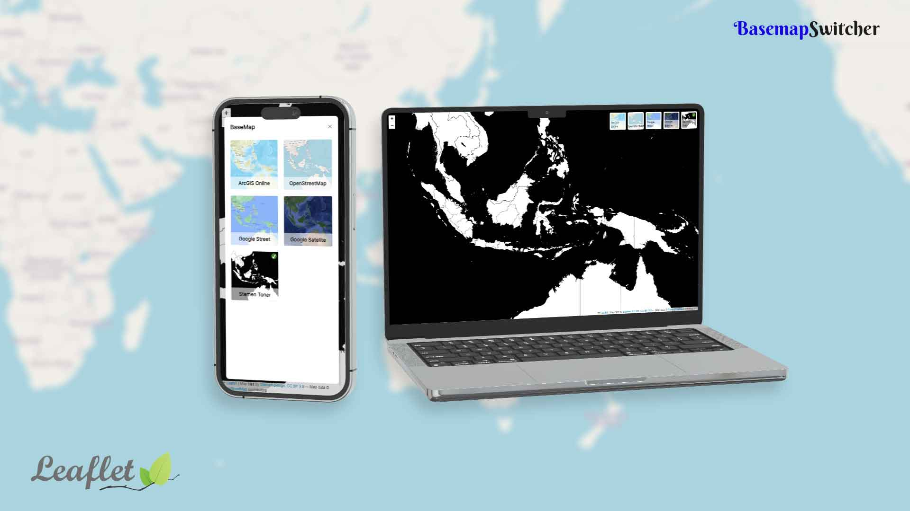

# Leaflet BaseMap Switcher
a simple plugins to make it easier to create a basemap control to make it look more attractive, besides that it is also responsive for mobile displays.


Based and inspired on [L.switchBasemap](https://github.com/clavijojuan/L.switchBasemap)
## Example
See the [example](https://as-shiddiq.github.io/leaflet-bmswitcher/example/index.html)

## How to usage?

```
npm i leaflet-bmswitcher
```
or download this repository direcly and save to your project.

and then include the `leaflet-bmswitcher.js` and don't forget also load `leaflet-bmswitcher.css` file from the `src/` dir, and then create an object and continue like the example below :
```js
const map = L.map('map').setView([-3.8420201, 114.727848], 13);
const bmList = [
	{
		layer :  L.tileLayer("http://server.arcgisonline.com/ArcGIS/rest/services/World_Street_Map/MapServer/tile/{z}/{y}/{x}.png",{attribution:"Map data © <a href=\\\"http://openstreetmap.org\\\">OpenStreetMap</a> contributors"}).addTo(map),
		name : "ArcGIS Online",
		icon : "assets/arcgis-online.png"
    },
	{
		layer :  L.tileLayer("https://{s}.tile.openstreetmap.org/{z}/{x}/{y}.png",{attribution:"&copy; <a href=\\\"https://www.openstreetmap.org/copyright\\\">OpenStreetMap</a> contributors"}),
		name : "OpenStreetMap",
		icon : "assets/osm.png"
    },
	{
		layer :  L.tileLayer("http://mt0.google.com/vt/lyrs=m&x={x}&y={y}&z={z}",{attribution:"Map data © <a href=\\\"http://openstreetmap.org\\\">OpenStreetMap</a> contributors"}),
		name : "Google Street",
		icon : "assets/google.png"
    },
	{
		layer :  L.tileLayer("http://mt0.google.com/vt/lyrs=s&x={x}&y={y}&z={z}",{attribution:"Map data © <a href=\\\"http://openstreetmap.org\\\">OpenStreetMap</a> contributors"}),
		name : "Google Satelite",
		icon : "assets/google-satelit.png"
    },
	{
		layer :  L.tileLayer("https://stamen-tiles-{s}.a.ssl.fastly.net/toner-background/{z}/{x}/{y}{r}.png",{attribution:"Map tiles by <a href=\"http://stamen.com\">Stamen Design</a>, <a href=\"http://creativecommons.org/licenses/by/3.0\">CC BY 3.0</a> &mdash; Map data &copy; <a href=\"https://www.openstreetmap.org/copyright\">OpenStreetMap</a> contributors"}),
		name : "Stemen Toner",
		icon : "assets/stemen-toner.png"
    }
];
new L.bmSwitcher(bmList).addTo(map);
```